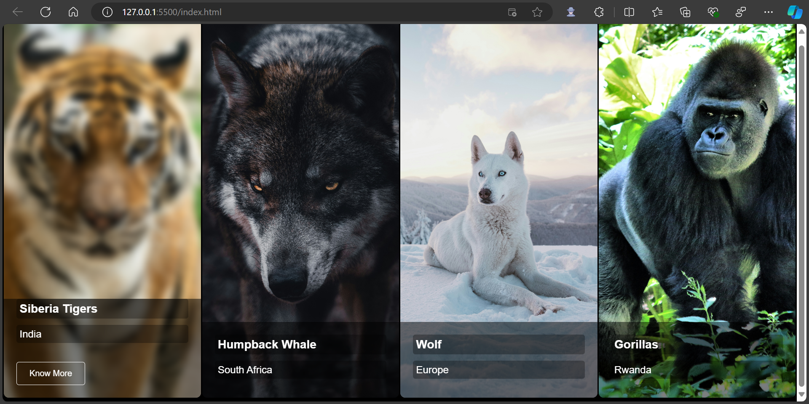
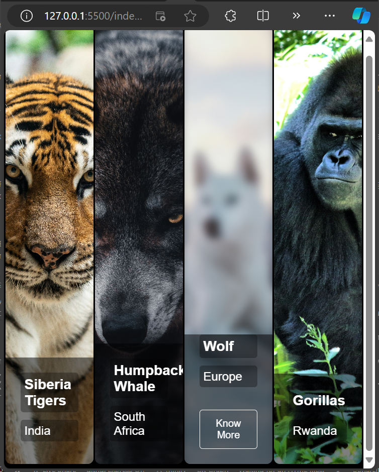

### Photo Gallery README Documentation

---

#### Table of Contents

1. [Introduction](#introduction)
2. [Features](#features)
3. [Installation](#installation)
4. [Usage](#usage)
5. [File Structure](#file-structure)
6. [Customization](#customization)
7. [Screenshots](#screenshots)
8. [Browser Compatibility](#browser-compatibility)
9. [Credits](#credits)
10. [License](#license)

---

### Introduction

Welcome to the **Responsive Photo Gallery** project! This project showcases a horizontally scrolling gallery with hover effects and detailed descriptions for each image. It is built using HTML, CSS, and JavaScript.

---

### Features

- **Responsive Design**: The gallery adjusts to various screen sizes, providing a smooth user experience on both desktop and mobile devices.
- **Hover Effects**: Images zoom in with a blur effect when hovered over, revealing additional information.
- **Hidden Content**: Additional details and buttons are revealed on hover, offering a clean initial display.
- **No Scrollbars**: The gallery hides horizontal scrollbars for a cleaner look.

---

### Installation

1. **Download the Repository**:
    - Clone the repository or download the ZIP file and extract it to your desired location.

2. **File Structure**:
    - Ensure that the following files are present:
      - `index.html`
      - `styles.css`
      - `script.js`
      - `images/` (folder containing your gallery images)

3. **Open the Project**:
    - Navigate to the project folder and open `index.html` in your preferred browser.

---

### Usage

1. **Viewing the Gallery**:
    - Open `index.html` in a web browser. The gallery will load, displaying images in a horizontal layout.

2. **Interacting with Images**:
    - Hover over any image to see the zoom-in effect and reveal more information and a button.

3. **Navigating**:
    - Scroll horizontally to view all images. On mobile devices, swipe to navigate through the gallery.

---

### File Structure

```
photo-gallery/
│
├── index.html            # The main HTML file for the gallery
├── styles.css            # Stylesheet for the gallery
├── script.js             # JavaScript file (currently not adding additional functionality)
├── images/               # Directory containing gallery images
│   ├── tiger.jpg
│   ├── wolf.jpg
│   ├── wolfie.jpg
│   └── Gorilla.jpg
```

---

### Customization

1. **Adding New Images**:
    - Place new images in the `images` folder.
    - Update the `index.html` file to include new `<div class="gallery-item">` sections for each new image.

2. **Changing Styles**:
    - Edit `styles.css` to customize the appearance of the gallery. Modify styles like hover effects, background colors, and more.

3. **Adding JavaScript Functionality**:
    - Enhance interactivity by updating `script.js`. You could add functions for modal displays, additional animations, or AJAX content loading.

---

### Screenshots

**Desktop View**:


**Mobile View**:


---

### Browser Compatibility

- This gallery is compatible with the latest versions of modern web browsers, including:
  - Google Chrome
  - Mozilla Firefox
  - Microsoft Edge
  - Safari

---

### Credits

- **Images**: All images used are credited to their respective owners. Ensure that you have the right to use any images you include.
- **Development**: This gallery was developed using HTML, CSS, and JavaScript.

---

### License

This project is open-source and available under the MIT License. Feel free to use and modify it as needed.

---

### Output

Upon opening the `index.html` file in a web browser, you will see a horizontally scrolling gallery displaying various images. Hovering over each image will reveal more information and a button, enhancing the visual appeal and user interactivity.

---
